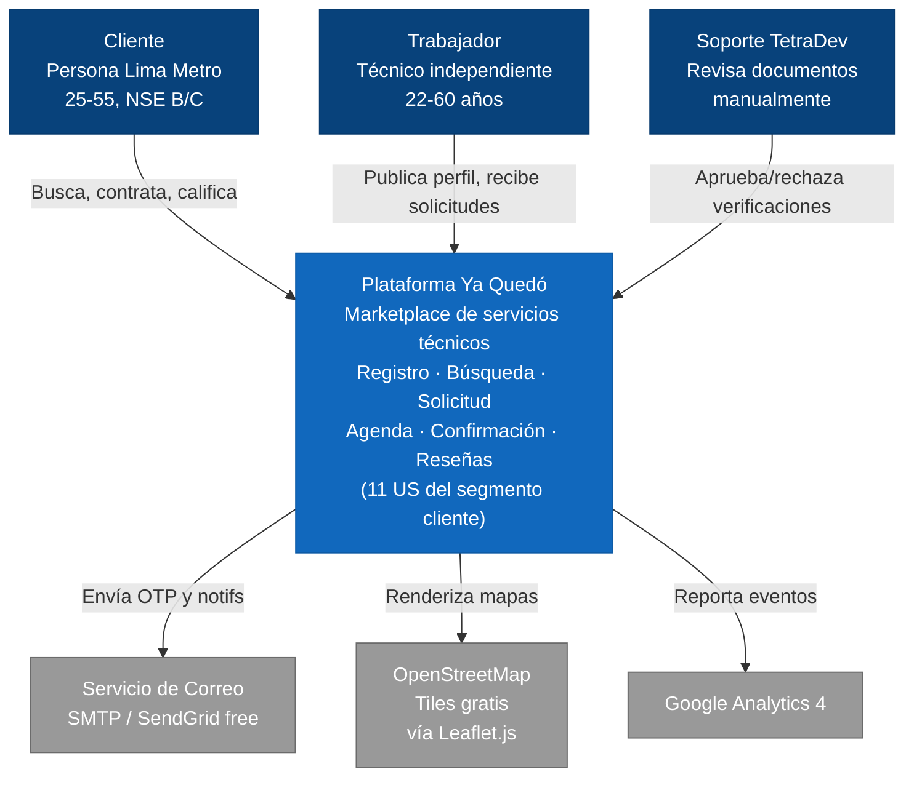
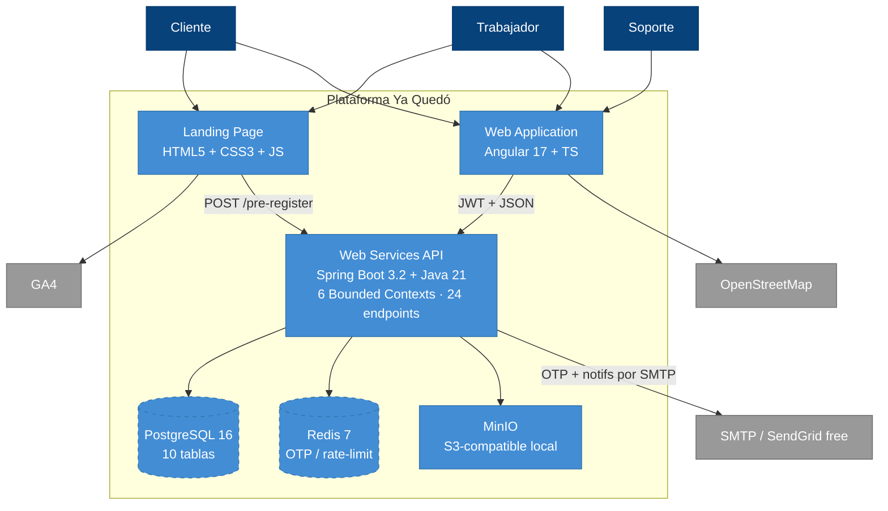

# Diagramas C4 · versiones Mermaid

Estos bloques se renderizan **automáticamente en GitHub, GitLab, Notion, Obsidian** y la mayoría de visores Markdown modernos. Si quieres exportar PNG/SVG, usa https://mermaid.live (pega el código entre ```mermaid ... ``` y obtienes la imagen).

> **Nota TB2 (2026-05-12)**: se removieron del alcance las integraciones de pago (Yape, Niubiz) y verificación automática RENIEC porque no son accesibles para el equipo. La verificación de identidad ahora la hace manualmente el **Equipo de Soporte** revisando las fotos en MinIO. Para mapas se usa **OpenStreetMap + Leaflet.js** (gratuito). OTPs se envían por **email SMTP** (SendGrid free tier o Gmail App Password) en lugar de SMS Twilio.

---

## Nivel 1 · Context Diagram



---

## Nivel 2 · Container Diagram



---

## Nivel 3 · Component Diagram (Backend Spring Boot · 6 Bounded Contexts)

```mermaid
flowchart TB
    classDef component fill:#85BBF0,stroke:#5D82A8,color:#000
    classDef container fill:#438DD5,stroke:#3373AC,color:#fff
    classDef external fill:#999999,stroke:#6B6B6B,color:#fff
    classDef db fill:#438DD5,stroke:#3373AC,color:#fff,stroke-dasharray:5 5

    webApp["Web Application<br/>Angular SPA"]:::container

    subgraph API["Web Services · Spring Boot 3.2"]

        subgraph IAM["IAM"]
            authCtrl["AuthController"]:::component
            authSvc["AuthenticationService"]:::component
            otpSvc["OtpService"]:::component
            jwt["JwtTokenProvider"]:::component
            userRepo["UserRepository"]:::component
        end

        subgraph Identity["Identity"]
            verifCtrl["VerificationController"]:::component
            verifSvc["VerificationService"]:::component
            minioAd["MinioStorageAdapter"]:::component
            verifRepo["VerificationRepository"]:::component
        end

        subgraph Catalog["Catalog"]
            catCtrl["CategoryController"]:::component
            catRepo["CategoryRepository"]:::component
        end

        subgraph Worker["Worker (US-03, US-04, US-05)"]
            wkCtrl["WorkerController"]:::component
            wkProf["WorkerProfileService"]:::component
            wkSearch["WorkerSearchService"]:::component
            wkRepo["Worker*Repository"]:::component
        end

        subgraph Booking["Booking (US-06 a US-09)"]
            srCtrl["ServiceRequestController"]:::component
            srSvc["ServiceRequestService"]:::component
            srRepo["ServiceRequestRepository"]:::component
            srAgg["ServiceRequest aggregate"]:::component
        end

        subgraph Reputation["Reputation (US-10, US-11)"]
            revCtrl["ReviewController"]:::component
            revSvc["ReviewService"]:::component
            revRepo["ReviewRepository"]:::component
            revAgg["Review aggregate"]:::component
        end

        subgraph CrossCutting["Cross-cutting"]
            sec["SecurityConfig"]:::component
            errH["GlobalExceptionHandler"]:::component
            emailAd["EmailAdapter"]:::component
            openapi["OpenApiConfig"]:::component
        end
    end

    db[("PostgreSQL 16<br/>10 tablas")]:::db
    redis[("Redis 7")]:::db
    storage["MinIO"]:::container
    emailExt["SMTP / SendGrid"]:::external

    webApp --> authCtrl
    webApp --> verifCtrl
    webApp --> catCtrl
    webApp --> wkCtrl
    webApp --> srCtrl
    webApp --> revCtrl

    authCtrl --> authSvc
    authSvc --> otpSvc
    authSvc --> jwt
    authSvc --> userRepo
    otpSvc --> redis
    otpSvc --> emailAd

    verifCtrl --> verifSvc
    verifSvc --> minioAd
    verifSvc --> verifRepo
    minioAd --> storage

    catCtrl --> catRepo
    wkCtrl --> wkProf
    wkCtrl --> wkSearch
    wkProf --> wkRepo
    wkSearch --> wkRepo
    wkSearch --> userRepo

    srCtrl --> srSvc
    srSvc --> srRepo
    srRepo --> srAgg

    revCtrl --> revSvc
    revSvc --> revRepo
    revSvc -.->|valida COMPLETED| srSvc
    revSvc -.->|recalcula ratingAvg| userRepo
    revRepo --> revAgg

    emailAd --> emailExt

    userRepo --> db
    verifRepo --> db
    catRepo --> db
    wkRepo --> db
    srRepo --> db
    revRepo --> db
```



---

## Cómo exportar a PNG

1. Copia el bloque `mermaid` que necesites.
2. Abre https://mermaid.live
3. Pega el código en el panel izquierdo.
4. En el panel superior derecho, click **"PNG"** o **"SVG"** para descargar.
5. Pega la imagen en el informe Word con su explicación.
