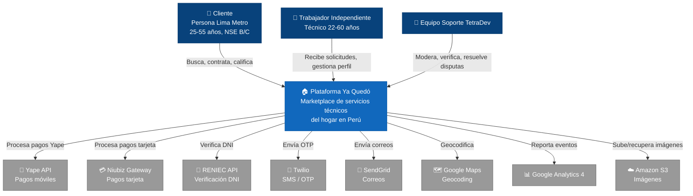
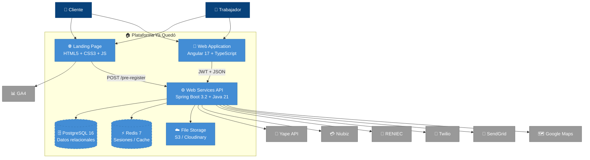

# Diagramas C4 · versiones Mermaid

Estos bloques se renderizan **automáticamente en GitHub, GitLab, Notion, Obsidian** y la mayoría de visores Markdown modernos. Si quieres exportar PNG/SVG, usa https://mermaid.live (pega el código entre `mermaid` y obtienes la imagen).

---

## Nivel 1 · Context Diagram

---

## Nivel 2 · Container Diagram

---

## Nivel 3 · Component Diagram (Backend Spring Boot)

```mermaid
flowchart TB
    classDef component fill:#85BBF0,stroke:#5D82A8,color:#000
    classDef container fill:#438DD5,stroke:#3373AC,color:#fff
    classDef external fill:#999999,stroke:#6B6B6B,color:#fff
    classDef db fill:#438DD5,stroke:#3373AC,color:#fff,stroke-dasharray:5 5

    webApp["📱 Web Application<br/>Angular SPA"]:::container

    subgraph API["⚙️ Web Services · Spring Boot 3.2"]

        subgraph IAM["IAM"]
            authCtrl["AuthController"]:::component
            authSvc["AuthenticationService"]:::component
            jwt["JwtTokenProvider"]:::component
            userRepo["UserRepository"]:::component
        end

        subgraph Identity["Identity"]
            verifCtrl["VerificationController"]:::component
            verifSvc["VerificationService"]:::component
            reniecAdapter["ReniecAdapter"]:::component
            verifRepo["VerificationRepository"]:::component
        end

        subgraph Catalog["Catalog"]
            catCtrl["CategoryController"]:::component
            catSvc["CategoryService"]:::component
            catRepo["CategoryRepository"]:::component
        end

        subgraph Worker["Worker"]
            wkCtrl["WorkerController"]:::component
            wkSvc["WorkerProfileService"]:::component
            wkSearch["WorkerSearchService"]:::component
            wkRepo["WorkerRepository"]:::component
        end

        subgraph Booking["Booking"]
            qCtrl["QuoteController"]:::component
            bkCtrl["BookingController"]:::component
            qSvc["QuoteService"]:::component
            bkSvc["BookingService"]:::component
            qRepo["QuoteRepository"]:::component
            bkRepo["BookingRepository"]:::component
        end

        subgraph Payment["Payment"]
            payCtrl["PaymentController"]:::component
            paySvc["PaymentService"]:::component
            yapeAd["YapeAdapter"]:::component
            niubizAd["NiubizAdapter"]:::component
            payRepo["PaymentRepository"]:::component
        end

        subgraph Reputation["Reputation"]
            revCtrl["ReviewController"]:::component
            revSvc["ReviewService"]:::component
            badge["BadgeService"]:::component
            revRepo["ReviewRepository"]:::component
        end

        subgraph Training["Training"]
            crCtrl["CourseController"]:::component
            crSvc["CourseService"]:::component
            quizSvc["QuizService"]:::component
            crRepo["CourseRepository"]:::component
        end

        subgraph Notification["Notification"]
            notif["NotificationService"]:::component
            emailAd["EmailAdapter"]:::component
            smsAd["SmsAdapter"]:::component
        end

        subgraph CrossCutting["Cross-cutting"]
            sec["SecurityConfig"]:::component
            audit["AuditAspect"]:::component
            errH["GlobalExceptionHandler"]:::component
        end
    end

    db[("🗄 PostgreSQL")]:::db
    reniec["🪪 RENIEC"]:::external
    yape["💜 Yape"]:::external
    niubiz["💳 Niubiz"]:::external
    twilio["📱 Twilio"]:::external
    sendgrid["📧 SendGrid"]:::external

    webApp --> authCtrl
    webApp --> verifCtrl
    webApp --> catCtrl
    webApp --> wkCtrl
    webApp --> qCtrl
    webApp --> bkCtrl
    webApp --> payCtrl
    webApp --> revCtrl
    webApp --> crCtrl

    authCtrl --> authSvc
    authSvc --> jwt
    authSvc --> userRepo

    verifCtrl --> verifSvc
    verifSvc --> reniecAdapter
    verifSvc --> verifRepo
    reniecAdapter --> reniec

    catCtrl --> catSvc
    catSvc --> catRepo

    wkCtrl --> wkSvc
    wkCtrl --> wkSearch
    wkSvc --> wkRepo
    wkSearch --> wkRepo

    qCtrl --> qSvc
    bkCtrl --> bkSvc
    qSvc --> qRepo
    bkSvc --> bkRepo
    qSvc --> notif

    payCtrl --> paySvc
    paySvc --> yapeAd
    paySvc --> niubizAd
    paySvc --> payRepo
    yapeAd --> yape
    niubizAd --> niubiz

    revCtrl --> revSvc
    revSvc --> badge
    revSvc --> revRepo

    crCtrl --> crSvc
    crSvc --> quizSvc
    crSvc --> crRepo
    crSvc --> badge

    notif --> emailAd
    notif --> smsAd
    emailAd --> sendgrid
    smsAd --> twilio

    userRepo --> db
    verifRepo --> db
    catRepo --> db
    wkRepo --> db
    qRepo --> db
    bkRepo --> db
    payRepo --> db
    revRepo --> db
    crRepo --> db
```

---

## Cómo exportar a PNG

1. Copia el bloque `mermaid` que necesites.
2. Abre https://mermaid.live
3. Pega el código en el panel izquierdo.
4. En el panel superior derecho, click en el ícono **"PNG"** o **"SVG"** para descargar.
5. Pega la imagen en el informe Word con su explicación.
