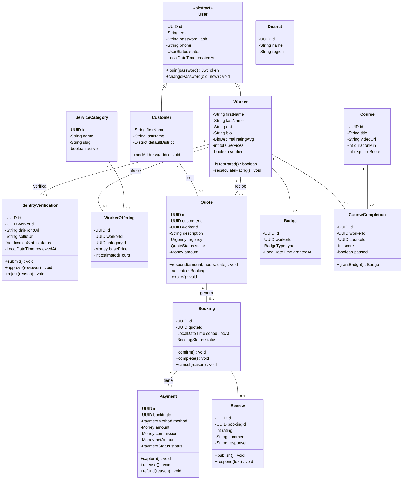
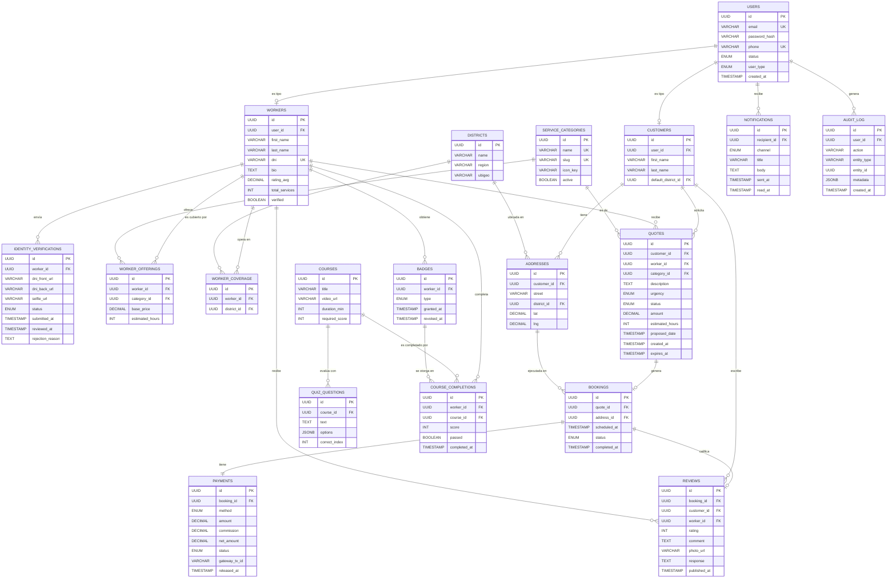

# Diagramas OO · versiones Mermaid

Render directo en GitHub o https://mermaid.live

---

## Class Diagram

---

## Database ER (modelo simplificado)

Para exportar a PNG: pega cualquiera de los bloques `mermaid` en https://mermaid.live y descarga.
