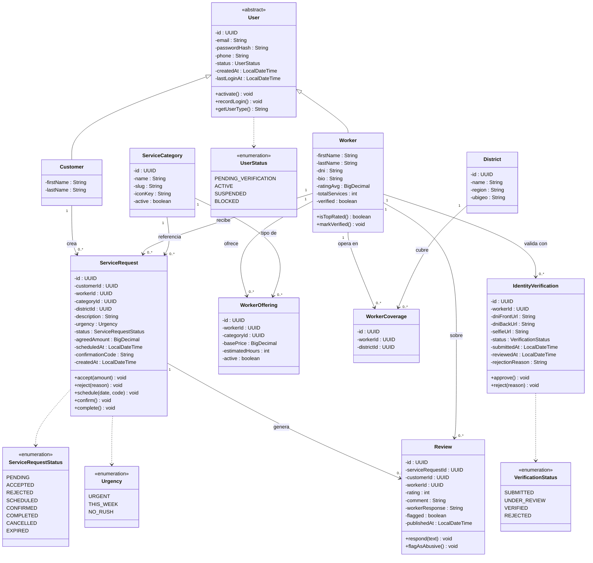

# Diagramas OO · versiones Mermaid (alcance TB2)

> Estos diagramas reflejan el alcance del Sprint 2: **6 Bounded Contexts y 10 tablas** cubriendo las **11 User Stories** del segmento "Usuario que Contrata". Payment quedó fuera del alcance al remover Yape y Niubiz; identity verification es manual (sin RENIEC).

---

## Diagrama de Clases · Dominio Ya Quedó (TB2)



---

## Modelo Entidad-Relación · Base de Datos (TB2 — 10 tablas)

```mermaid
erDiagram
    users {
        UUID id PK
        VARCHAR email UK
        VARCHAR password_hash
        VARCHAR phone UK
        VARCHAR status
        VARCHAR user_type
        TIMESTAMP created_at
        TIMESTAMP last_login_at
    }
    customers {
        UUID id PK_FK
        VARCHAR first_name
        VARCHAR last_name
    }
    workers {
        UUID id PK_FK
        VARCHAR first_name
        VARCHAR last_name
        VARCHAR dni UK
        TEXT bio
        DECIMAL rating_avg
        INT total_services
        BOOLEAN verified
    }
    identity_verifications {
        UUID id PK
        UUID worker_id FK
        VARCHAR dni_front_url
        VARCHAR dni_back_url
        VARCHAR selfie_url
        VARCHAR status
        TIMESTAMP submitted_at
        TIMESTAMP reviewed_at
        TEXT rejection_reason
        UUID reviewed_by FK
    }
    service_categories {
        UUID id PK
        VARCHAR name UK
        VARCHAR slug UK
        TEXT description
        VARCHAR icon_key
        BOOLEAN active
    }
    districts {
        UUID id PK
        VARCHAR name
        VARCHAR region
        VARCHAR ubigeo
    }
    worker_offerings {
        UUID id PK
        UUID worker_id FK
        UUID category_id FK
        DECIMAL base_price
        INT estimated_hours
        BOOLEAN active
    }
    worker_coverage {
        UUID id PK
        UUID worker_id FK
        UUID district_id FK
    }
    service_requests {
        UUID id PK
        UUID customer_id FK
        UUID worker_id FK
        UUID category_id FK
        UUID district_id FK
        TEXT description
        VARCHAR urgency
        VARCHAR status
        DECIMAL agreed_amount
        TIMESTAMP scheduled_at
        VARCHAR confirmation_code
        TEXT rejection_reason
        TIMESTAMP created_at
        TIMESTAMP accepted_at
        TIMESTAMP completed_at
    }
    reviews {
        UUID id PK
        UUID service_request_id UK_FK
        UUID customer_id FK
        UUID worker_id FK
        INT rating
        TEXT comment
        TEXT worker_response
        BOOLEAN flagged
        TIMESTAMP published_at
        TIMESTAMP responded_at
    }

    users ||--|| customers : "tiene perfil"
    users ||--|| workers : "tiene perfil"
    workers ||--o{ identity_verifications : "envía"
    workers ||--o{ worker_offerings : "ofrece"
    service_categories ||--o{ worker_offerings : "tipo de"
    workers ||--o{ worker_coverage : "cubre"
    districts ||--o{ worker_coverage : "se cubre en"
    customers ||--o{ service_requests : "crea"
    workers ||--o{ service_requests : "recibe"
    service_categories ||--o{ service_requests : "referencia"
    districts ||--o{ service_requests : "ubica en"
    service_requests ||--o| reviews : "genera (UNIQUE)"
    workers ||--o{ reviews : "sobre"
```

---

## Cómo exportar a PNG

1. Copia el bloque `mermaid` que necesites.
2. Abre https://mermaid.live
3. Pega el código.
4. Click **PNG** o **SVG** en el panel superior derecho.
5. Inserta la imagen en el Word (secciones 4.7.1 y 4.7.2) con su explicación técnica.
